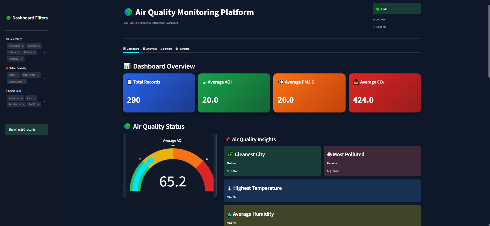
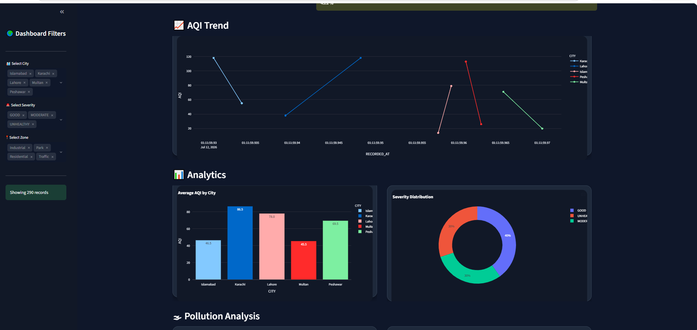
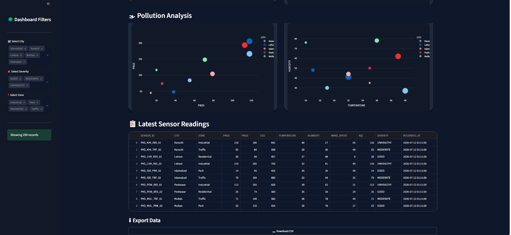

# 🌍 Smart City Air Quality Monitoring Dashboard

> **SMIT Data Engineering Hackathon Project**

A real-time Air Quality Monitoring System that simulates IoT sensors, processes data through an ETL pipeline, stores it in Snowflake, and visualizes live insights using Streamlit.

---

# 📖 Project Overview

This project demonstrates a complete Data Engineering pipeline.

The system continuously generates air quality sensor data every **10 seconds**, cleans and transforms it using an ETL process, uploads the latest records to **Snowflake Data Warehouse**, and displays a live interactive dashboard built with **Streamlit**.

---

# 🚀 Features

- ✅ Real-Time IoT Air Quality Simulation
- ✅ Automatic Data Generation Every 10 Seconds
- ✅ ETL Data Cleaning Pipeline
- ✅ Snowflake Cloud Data Warehouse
- ✅ Live Streamlit Dashboard
- ✅ Auto Refresh Every 10 Seconds
- ✅ Dynamic KPI Cards
- ✅ AQI Gauge Chart
- ✅ City-wise AQI Analysis
- ✅ Severity Distribution
- ✅ Pollution Analysis
- ✅ Interactive Charts
- ✅ Sensor Data Table
- ✅ CSV Download

---

# 🛠 Technologies Used

| Technology | Purpose |
|------------|---------|
| Python | Data Processing |
| Pandas | ETL |
| Snowflake | Cloud Data Warehouse |
| SQL | Data Queries |
| Streamlit | Dashboard |
| Plotly | Data Visualization |

---

# 🏗 System Architecture

```
IoT Simulator
      │
      ▼
Generate Sensor Data
      │
      ▼
CSV File
      │
      ▼
ETL Pipeline
(Data Cleaning)
      │
      ▼
Snowflake Data Warehouse
      │
      ▼
Streamlit Dashboard
      │
      ▼
Live Analytics
```

---

# 📂 Project Structure

```
Hackathon/
│
├── api/
│
├── dashboard/
│   ├── app.py
│   ├── components.py
│   ├── config.py
│   ├── data_loader.py
│   ├── snowflake_utils.py
│   └── style.css
│
├── etl/
│   ├── etl.py
│   └── clean_iot_data.csv
│
├── simulator/
│   ├── simulator.py
│   └── iot_readings.csv
│
├── load_to_snowflake.py
│
├── requirements.txt
│
└── README.md
```

---

# 📊 Dashboard Features

### Dashboard Overview

- Total Records
- Average AQI
- Average PM2.5
- Average CO₂

---

### Air Quality Monitoring

- AQI Gauge
- Cleanest City
- Most Polluted City
- Highest Temperature
- Average Humidity

---

### Analytics

- AQI Trend
- Average AQI by City
- Severity Distribution
- Pollution Scatter Plot
- Temperature vs Humidity

---

### Sensor Monitoring

- Live Sensor Readings
- CSV Export

---

# 🔄 Workflow

1. Simulator generates IoT sensor readings.
2. Data is stored in CSV.
3. ETL cleans the generated data.
4. Latest records are uploaded to Snowflake.
5. Streamlit fetches data from Snowflake.
6. Dashboard refreshes automatically every 10 seconds.


# 📸 Dashboard Preview

## 📊 Dashboard Overview


## 📈 Analytics


## 📋 Raw Data


---

# ▶️ How to Run

### Install Dependencies

```bash
pip install -r requirements.txt
```

### Run Simulator

```bash
python simulator/simulator.py
```

### Run Dashboard

```bash
cd dashboard

streamlit run app.py
```

---

# 📸 Dashboard Preview

> Add your dashboard screenshot here.

Create an **images** folder and save your screenshot as:

```
images/dashboard.png
```

Then uncomment the line below after adding the screenshot.

```markdown

```

---

# 👨‍💻 Developer

**Maaz Danish**

Bachelor of Business Computing

Muhammad Ali Jinnah University (MAJU)

SMIT Cloud Data Engineering Student

---

# ⭐ Project Highlights

- Real-Time Dashboard
- Cloud Data Warehouse
- ETL Pipeline
- IoT Data Simulation
- Data Visualization
- Streamlit Application
- Snowflake Integration

---

## Thank You ❤️

This project was developed as part of the **SMIT Data Engineering Hackathon**.